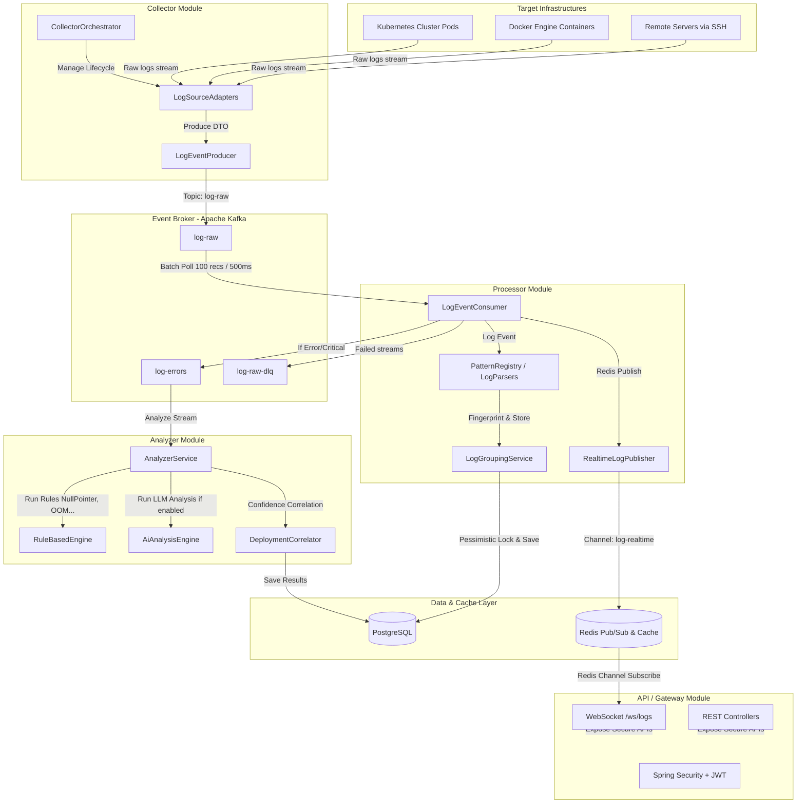

# FaultLens Backend — System Architecture Document

FaultLens (also known as LogLens) is a real-time distributed log analysis, group indexing, and anomaly-correlation platform built with **Java 21**, **Spring Boot 3.3**, **Apache Kafka**, **Redis**, and **PostgreSQL**.

---

## 1. System Topology & Data Flow Pipeline

The backend is built as a modular Maven multi-module architecture to separate responsibilities strictly, maintaining high modularity, readability, and adherence to SOLID design principles.

---

## 2. Multi-Module Project Structure

| Module | Purpose | Key Responsibilities |
| :--- | :--- | :--- |
| **`common`** | Shared Contract Layer | Core DTOs (`LogEventDto`, `LogEntryDto`, `ApiResponse`), custom Domain exceptions, and standard enums (`Severity`, `LogSourceType`). |
| **`collector`** | Data Collection & Ingestion | Connection lifecycle, background task orchestration, SSH/Docker/Kubernetes adapters, and reliable Kafka producing. |
| **`processor`** | Log Parsing & Ingestion Pipeline | High-throughput batch polling, regex parser priority chain (`PatternRegistry`), SHA-256 fingerprint grouping, and database ingestion. |
| **`analyzer`** | Intelligence & Anomaly Rules | Rule-based engine, AI OpenAI engine fallback, confidence scoring, and deployment impact window correlation. |
| **`api`** | Gateway & Presentation Layer | Stateless REST API routes, JWT security validation, global error handling, Redis cache layer, and real-time WebSockets broadcast. |

---

## 3. Key Architectural Design Decisions & Core Mechanisms

### A. Thread-Safe and Idempotent Streaming Ingestion
The **`CollectorOrchestrator`** runs each active log source in a dedicated thread managed by a cached thread pool with custom thread naming (e.g. `loglens-collector-*`).
- Uses `ConcurrentHashMap` for running states and active connection resource scopes.
- Gracefully reacts to `SIGTERM` / shutdown hooks via `@PreDestroy` method, closing active SSH channels, socket connections, and executor threads cleanly without leaking connections.

### B. Parser Priority Chain (Open/Closed Principle)
The **`processor`** module parses logs using the **Strategy Pattern**:
- An interface `LogParser` is defined. Concrete classes like `JavaStackTraceParser` (Priority 10), `SpringBootLogParser` (Priority 15), `NginxLogParser` (Priority 20), and `GenericLogParser` (Priority 999) implement this.
- `PatternRegistry` registers all active strategies and sorts them by priority.
- If a parser matches a log format, it extracts structured fields (timestamp, severity, logger, message) and breaks early, ensuring optimal CPU utilization.

### C. High-Concurrency Fingerprint Grouping (Pessimistic Locking)
Logs can arrive at thousands of events per second. Multiple threads running `LogProcessorService` can try to insert or update the exact same log template group.
- Log groups are identified using SHA-256 fingerprints (calculated from stack traces or log severities + message substrings).
- **Fingerprint Lock Strategy:** `LogGroupRepository` implements a query with `Pessimistic Write Lock` (`@Lock(LockModeType.PESSIMISTIC_WRITE)`) on a fingerprint lookup, preventing multi-threaded race conditions (duplicate key violations or incorrect counters) when updating the database.

### D. Anomaly Analysis Fallback & Confidence Scoring
When an `ERROR` or `CRITICAL` log is processed, the **`analyzer`** runs a multi-layered analysis:
- **Layer 1: Rule-Based Engine:** Runs local deterministic checks (`NullPointerRule`, `OutOfMemoryRule`, `DatabaseConnectionRule`, etc.) which are fast and cost-free.
- **Layer 2: AI Engine (OpenAI):** Runs if enabled and available. It parses OpenAI responses to a strict JSON structure containing the root cause and suggestions.
- **Fallback Integration:** The service compares the rule-based result score with the AI confidence score and selects the one with the highest confidence. If OpenAI is down or times out, it gracefully falls back to the local rule result.

### E. Deployment Correlation Windows
When an anomaly is discovered, the `DeploymentCorrelator` queries the database for deployments that occurred prior to the anomaly:
- **$\le$ 30 Minutes:** Extreme correlation. The anomaly is linked to the deployment with `1.0` confidence modifier.
- **30 Minutes to 2 Hours:** Moderate correlation. Link is recorded, but confidence score is reduced by `0.3`.
- **> 2 Hours:** Uncorrelated. No linkage is established.

---

## 4. Applied SOLID & Clean Code Guidelines

- **Single Responsibility (SRP):** API controllers are completely decoupled from business logic and Mapper converters. They only validate parameters and translate schemas.
- **Open/Closed (OCP):** New log parsers or anomaly detection rules can be added simply by implementing `LogParser` or `AnalysisRule` and registering them as Spring Beans. The engine picks them up dynamically.
- **Liskov Substitution (LSP):** All adapters inherit from `LogSourceAdapter`, conforming to lifecycle contracts (`startStreaming`, `stopStreaming`, `testConnection`).
- **Interface Segregation (ISP):** Common models and service contracts are split into distinct read-only and write actions.
- **Dependency Inversion (DIP):** Modules depend on interfaces rather than direct implementations, utilizing Spring's IoC container for clean dependency injection.
